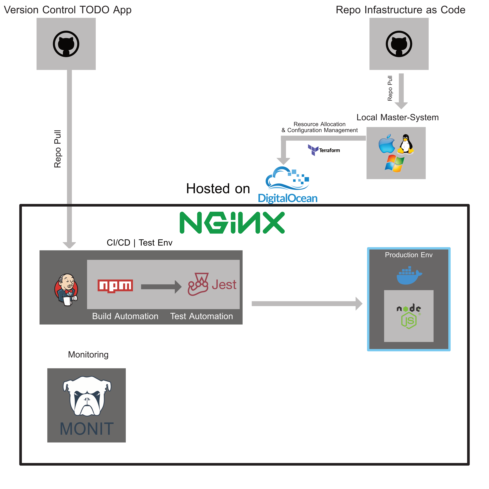

## DevOps Sommer-Semester 2020
Dieses Dokument gibt eine kurze Übersicht, über den Techstack, der Verwendet werden soll und gibt die Begründung für die Auswahl der einzellnen Komponenten an.

## Darstellung der CI/CD Architektur der Infrakstruktur.

## Auswahl und Begründung
Wir verwenden...

- **Digital Ocean** - Bietet Schnittstelle für Terraform, sowie eine gute Dokumentation für das Aufsetzen von Servern. 
- **Terraform** - Infrastructure as Code Tool zum aufsetzen und Bootstrapen des Servers 
- **GitHub** - Kostenfrei, weitverbreitet und Erfahrungswerte vorhanden sind. Technisch sogrt Github für die Versionierung des Codes.
- **Jenkins** - Da es Kostenfrei und weitverbreitet ist, sowie einen guten Community-Support und unbegrenzte Erweiterungsmöglichkeiten bietet. Jenkins biete die Möglichkeit einen CI/CD Process für die Applikation zu erstellen.
- **npm** - Zum Scripten des Building-Processes.
- **Jest** - Bietet eine sehr einfache Implementierung und ist das gängie Test-Framework für Node.js ist. 
- **Docker** - Für die Kontainerisierung von Anwendungen.
- **Monit** - Für das Monitoring des Servers
- **Python Librarys** - Verwendete Library sind: python-jenkins, PyGithub.
- **MongoDB** - Vorgegeben durch Dozenten
- **KasAPI** - Für die Automatisierung der Domain
- **Certbot** - Zum aufsetzen von Https
- 
## Erklärung des Autmomationsprocesses
1. Die React App mit dem Jenkinsfile wird auf einen gesonderten "deploy" branch gepusht
2. Jenkins horcht auf diesen Branch pulled diesen und liest das Jenkinsfile aus sobald ein update verfügbar ist
3. Nach dem auslesen des Jenkinfiles startet Jenkins einen build
4. Jenkins startet npm, um die dependencies zu fetchen
5. Jenkins startet jest und führt die Tests aus
6. Sind alle Test positiv muss der Deploy durch einen Benutzer validiert werden.
7. Wird der Deploy validiert wird das Dockerfile im Projekt ausgelesen und ein Docker Container und Image erstellt
8. Jenkins deployed die App auf Digital Ocean

